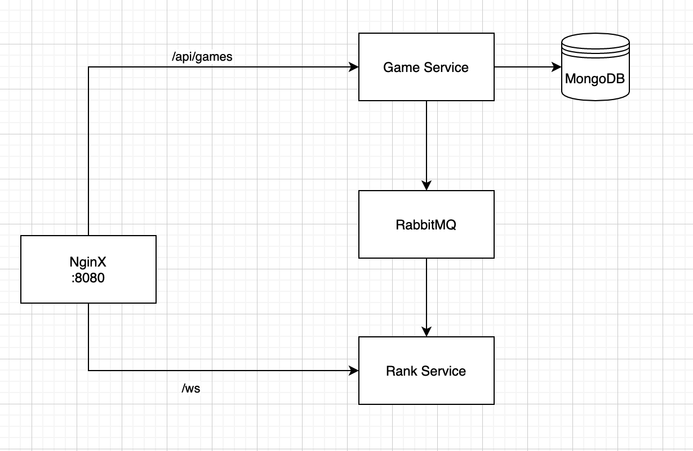

FASTAPI <3

Architecture


---
## Run
- make sure you have instlled `docker` and `docker-compose`
- run
```bash
  docker compose up -d
```
- http://localhost:8080/api/ for game api
- ws://localhost:8080/ws for rank socket
---
## Documents
### for api visit.
- http://localhost:8080/api/docs
or postman collection at in `docs` folder.

### for socket
- connect to 
ws://localhost:8080/ws
whenever the game finished with new high score then it will publish to you such as '{"score": 12}'

### mongo-express
- http://localhost:8081

### rabbit-management
user = guest
pass = guest
- http://localhost:15672